# Hi 👋
## A passionate blockchain enginner
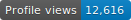

I am currently working remotely.

❤️ **I'm passionate about:**

I am blockchain developer
 I have 6+ years of experience writing blockchain web apps that span consumer productivity software to mission-critical financial trading platforms. I have extensive knowledge of smart contract, front-end JavaScript and browser APIs as well as significant experience with popular frameworks and libraries like React and Redux. As a full stack developer, my main programming language is Javascript, Solidty, Rust, Python. I have good experience with ❤️Rust❤️, Solidity, Web3, ❤️React.js❤️, Ethers, Python, Openzepplin. Particularly Solidity and Rust is my ❤️ framework and also I have rich experenice on React Framework(MERN), Truffle. Including framwork that said above, I have done 10+ web site with MERN, Nuxt, Next, Web3, Ethers.

I have also strong technical understanding of various machine learning algorithms, including Neural networks and Deep learning.

### About Me
#### Main Skills

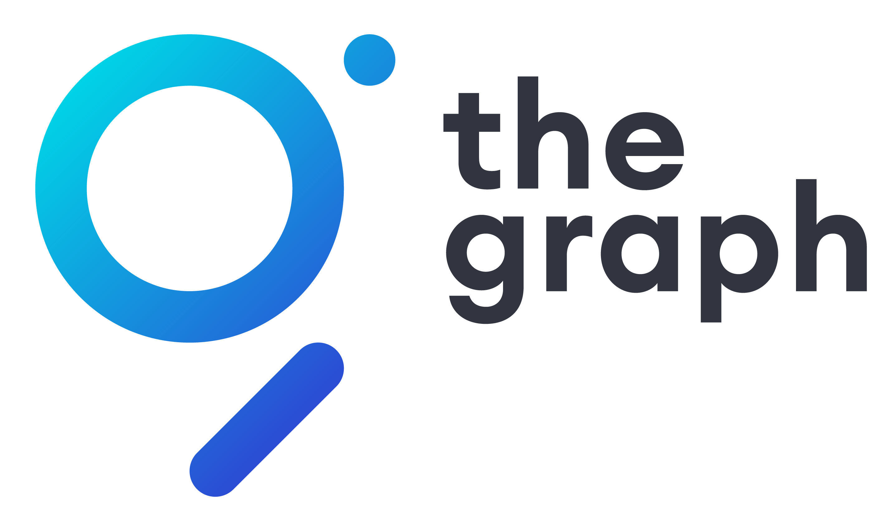

### Git Work

## Lastest Product
### Defi
#### [Geist Finance on Fantom](https://geist.finance/)
---
<a href='https://geist.finance/markets' target='_blank'>
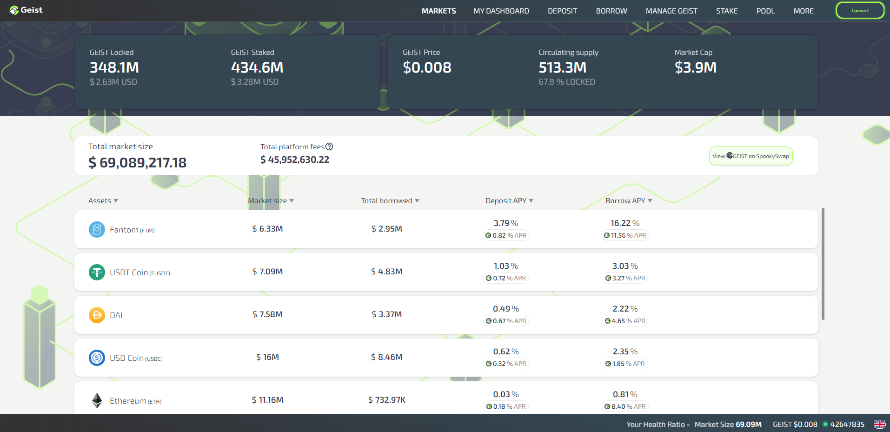</img>
</a>

[Geist Contract](https://github.com/goldenstar111/Geist-Finance-Contracts)

#### [Tree Defi Finance on BSC](https://treedefi.com/)
---
##### Main Homepage
<a href='https://app.treedefi.com/' target='_blank'>
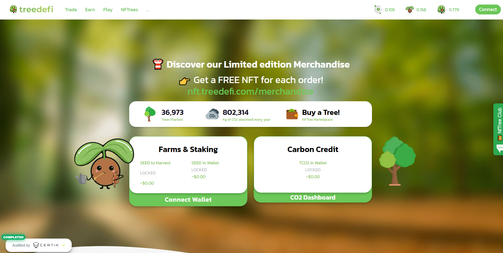</img>
</a>

##### Defi, NFT Staking, NFT Marketplace
<a href='https://dex.treedefi.com/' target='_blank'>
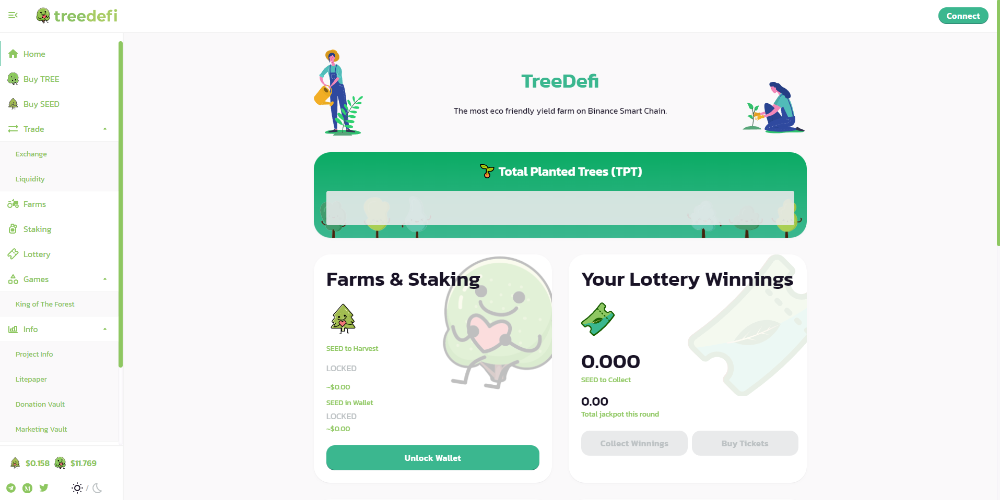</img>
</a>
<a href='https://nft.treedefi.com/' target='_blank'>
</img>
</a>
<a href='https://nft.treedefi.com/merchandise' target='_blank'>
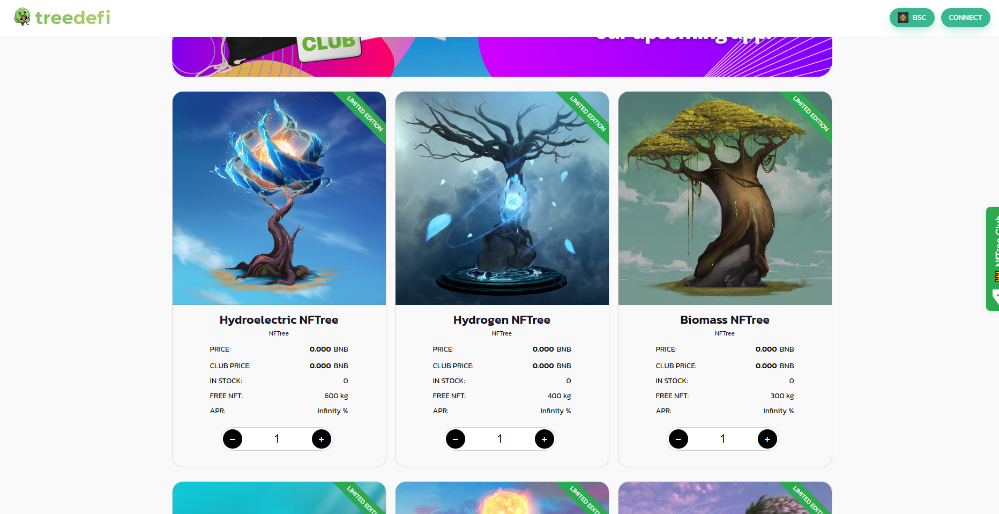</img>
</a>

[Tree Defi Contract](https://github.com/goldenstar111/treedefi-contracts)

### [Nearnauts Eco System on Near Chain](https://nearnauts.io/)
#### Nearnauts - First Generative NFT Project on Near Chain
<a href='https://nearnautss.netlify.app/' target='_blank'>
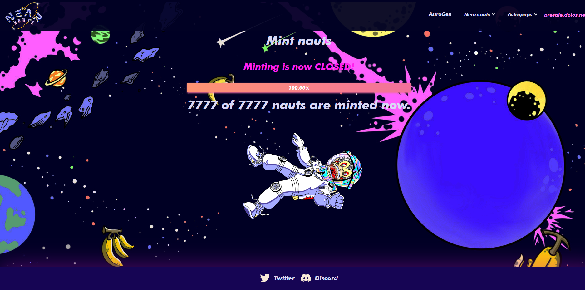</img>
</a>

#### Astrogen - First Generative NFT Launch Pad on Near Chain
<a href='https://astrogen.io/' target='_blank'>
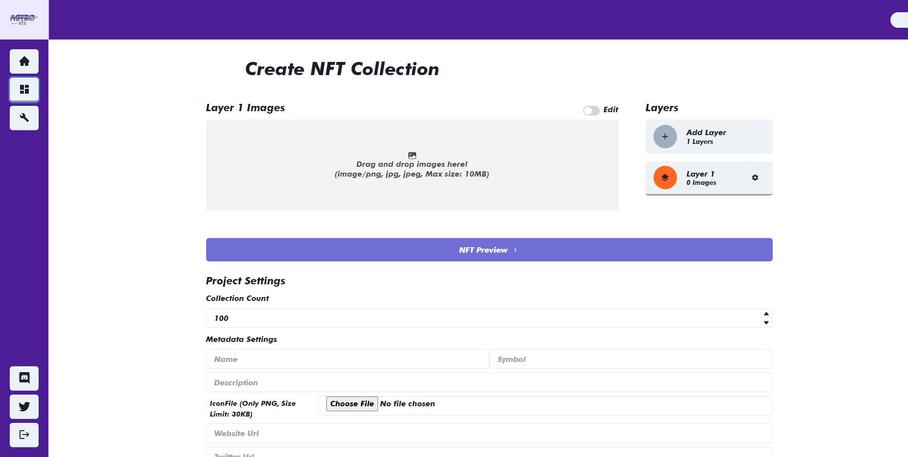</img>
</a>

#### [AstroMarket - Generative NFT Marketplace on Near Chain](https://astromarket.io/)
<a href='https://astromarket1.netlify.app/' target='_blank'>
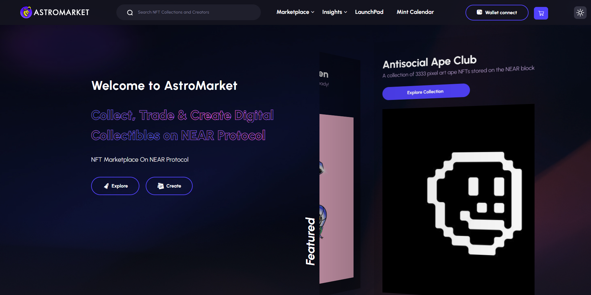</img>
</a>

#### Kaizo NFT Staking

Kaizo Fighters can be staked on Staking Pool and people can take $dojo from pool as rewards based on staking time and amount

<a href='https://kaizo-staking.netlify.app/' target='_blank'>
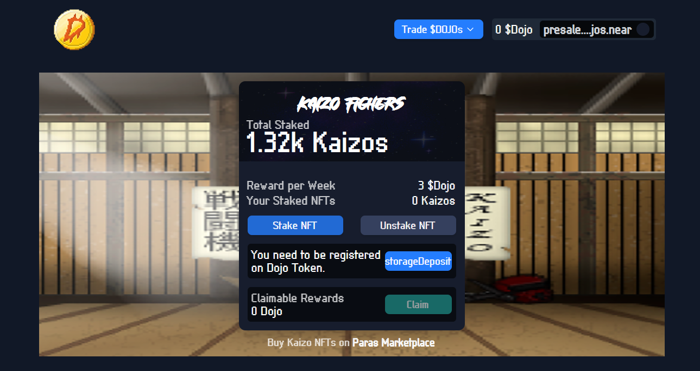</img>
</a>

### [Vesq Finance on Polygon Main Net](https://vesq.io)
---
<a href='https://vesq.io' target='_blank'>
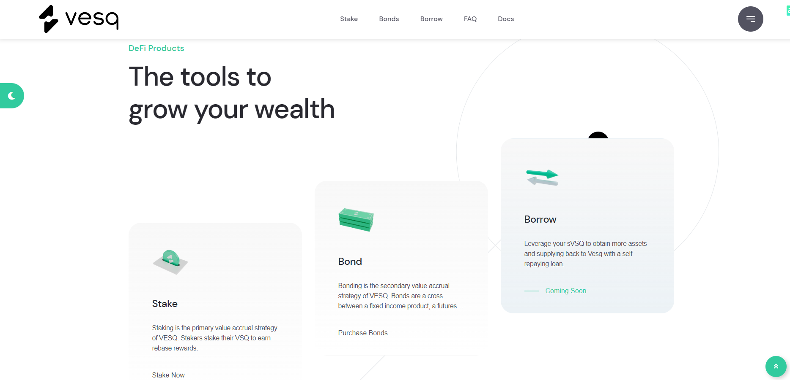</img>
</a>
<a href='https://app.vesq.io' target='_blank'>
</img>
</a>

[Vesq Finance Frontend - React-web3](https://github.com/goldenstar111/VESQ-DAO)

### [Blockchain Domain Name Service on Fantom](https://fantomdomains.io/)
---
#### [FNS](https://fantomdomains.io/)
<a href='https://fantomnameservice.netlify.app/' target='_blank'>
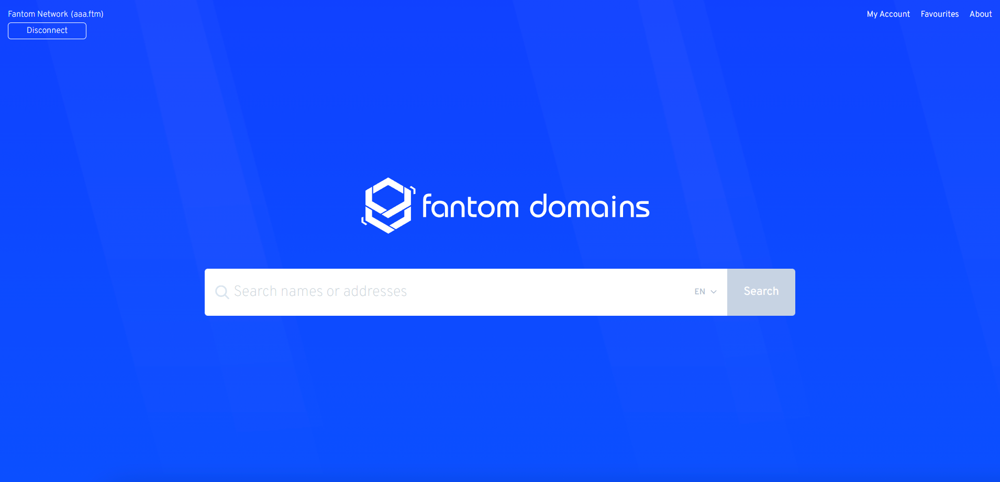</img>
</a>
<a href='https://fantomnameservice.netlify.app/search/aaa' target='_blank'>
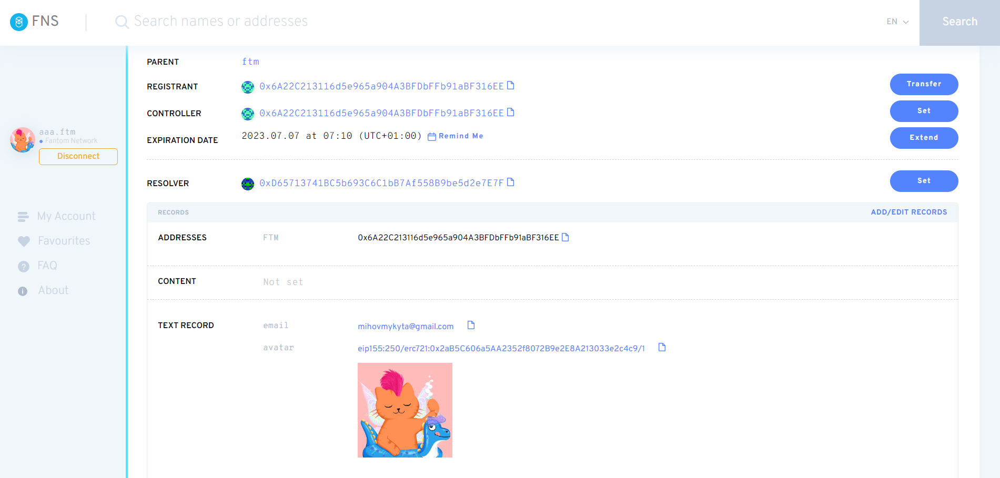</img>
</a>

- [FNS Contract](https://github.com/goldenstar111/FNS-Contract)
- [FNS Subgraph](https://github.com/goldenstar111/FNS-Subgraph)
- [FNS Metadata Service Backend](https://github.com/goldenstar111/Fns-Metadata-Service-Backend)
- [FNS Main Frontend](https://github.com/goldenstar111/FNS-App-Frontend)
- [FNS Deployed Subgraph](https://thegraph.com/hosted-service/subgraph/goldenstar111/fnsindexer)
- [FNS Deployed Contract](https://ftmscan.com/address/0x5BE3c31449306e15B6bc29065Efc4CdCa47C10C8#code)

### [EggPlant NFT Mint on Ethereum](https://eggplantnftmint.netlify.app/)
---
<a href='https://eggplantnftmint.netlify.app/'>
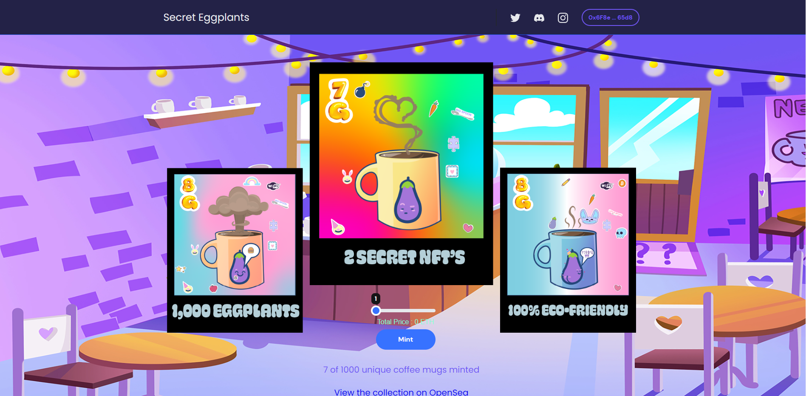</img>
</a>

- [NFT Contract](https://rinkeby.etherscan.io/address/0x5098016A35851F6115816863f436dc3e85d999ED#code)
- [Main Mint Frontend](https://github.com/goldenstar111/EggPlant-NFT-Mint-App)

### [Scorpfion Dragon NFT Marketplace on BSC](https://nft.scorpion-finance.com/)
---
<a href='https://scorpfionnft.netlify.app/'>
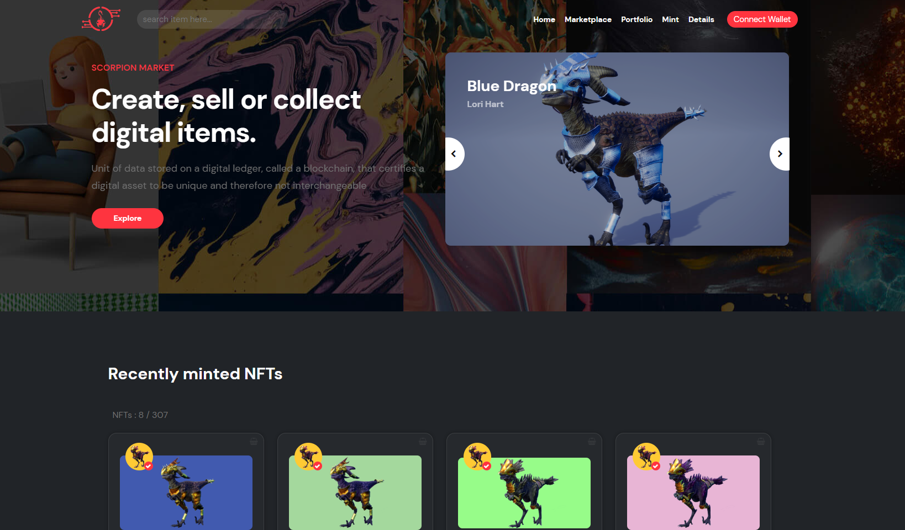</img>
</a>

- [Marketplace Contract](https://github.com/goldenstar111/Scorpfion-NFT-Contract)
- [Marketplace Subgraph](https://github.com/goldenstar111/Scorpion-NFT-Marketplace-Subgraph)
- [Marketplace Backend](https://github.com/goldenstar111/Scorpfion-NFT-Marketplace-on-BSC/tree/main/backend)
- [Marketplace indexer](https://thegraph.com/hosted-service/subgraph/goldenstar111/marketplace)
- [Marketplace Main Frontend](https://github.com/goldenstar111/Scorpfion-NFT-Marketplace-on-BSC/tree/main/frontend)

### Staking
#### [Bonsai NFT Staking](https://bonsaidefi.netlify.app/)
---
<a href='https://bonsaidefi.netlify.app/'>
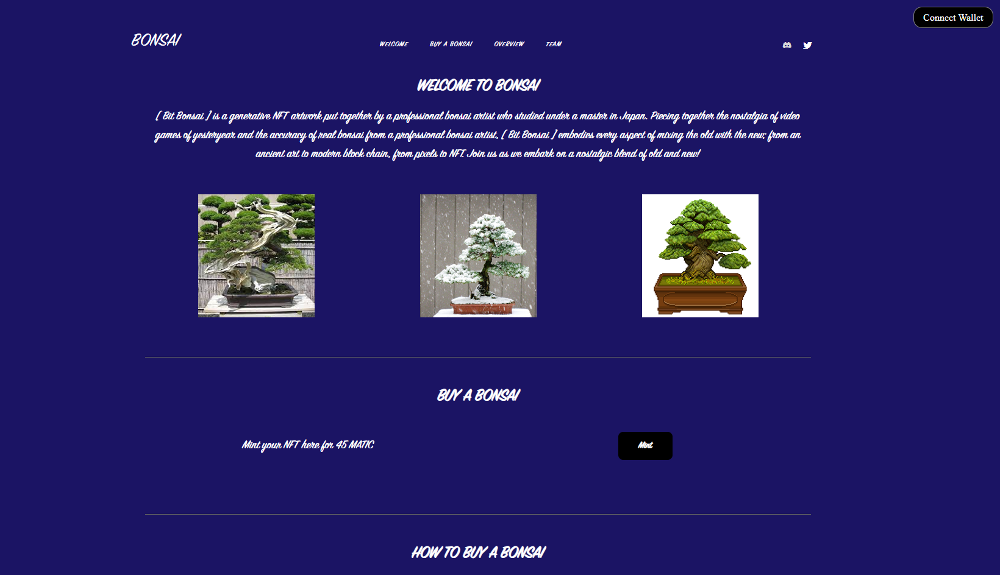</img>
</a>

- [Src](https://github.com/goldenstar111/Bonsai-NFT-Staking-App)
- [Deployed Satking Contract](https://github.com/goldenstar111/Bonsai-NFT-Staking-Contract)

#### [Satin Token Staking on BSC](https://satintoken.com/)
---
<a href='https://satintoken.com/'>
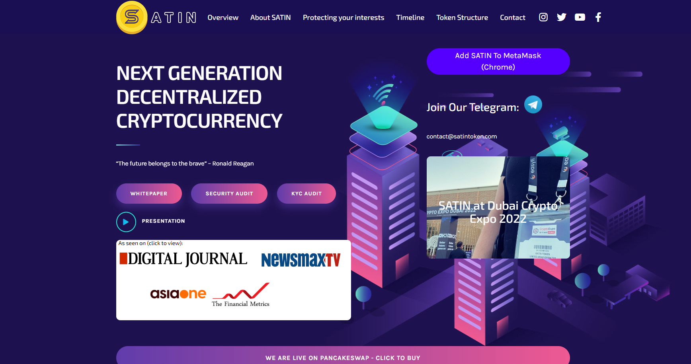</img>
</a>
<a href='https://satinsafe.space/'>
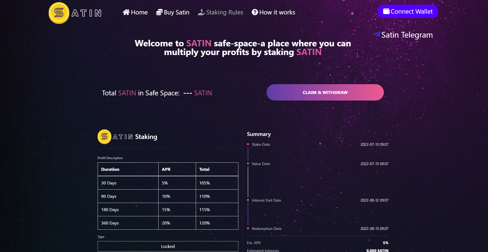</img>
</a>

- [Src](https://github.com/goldenstar111/Satin-Staking-on-BSC)
- [Deployed Satking Contract](https://bscscan.com/address/0x66EDd71A2b816964b77351e25aD456dC50aEea42#code)

#### [Avax Fomo Staking on Avax Chain](https://avaxfomo.netlify.app/)
---
<a href='https://avaxfomo.netlify.app/'>
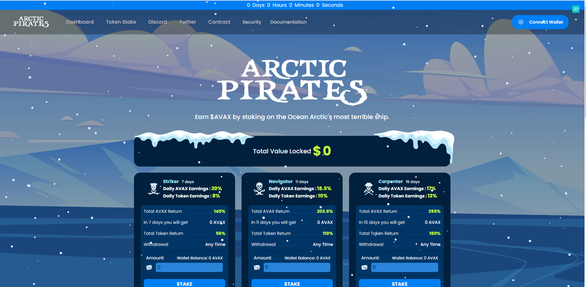</img>
</a>

- [Deployed Satking Contract](https://testnet.snowtrace.io/address/0xa7557a35fd52cd6b09ec71db2e3bfd76b5455a9c)

#### [MMX Staking on Harmony Chain]()
---
<a href='https://stakemmx.herokuapp.com/'>
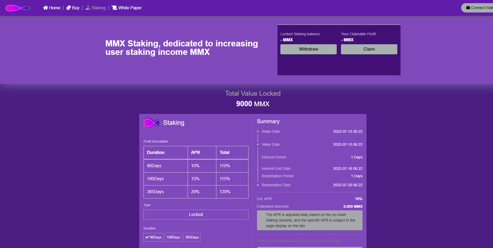</img>
</a>

- [Deployed Satking Contract](https://explorer.harmony.one/address/0xe908142aeb76358abd0d0d0f62ee7ed982be1c75?activeTab=7)

### Presale Site
#### [Atari Token Presale](https://atarichain.com/)
---
<a href='https://defi.atarichain.com/'>
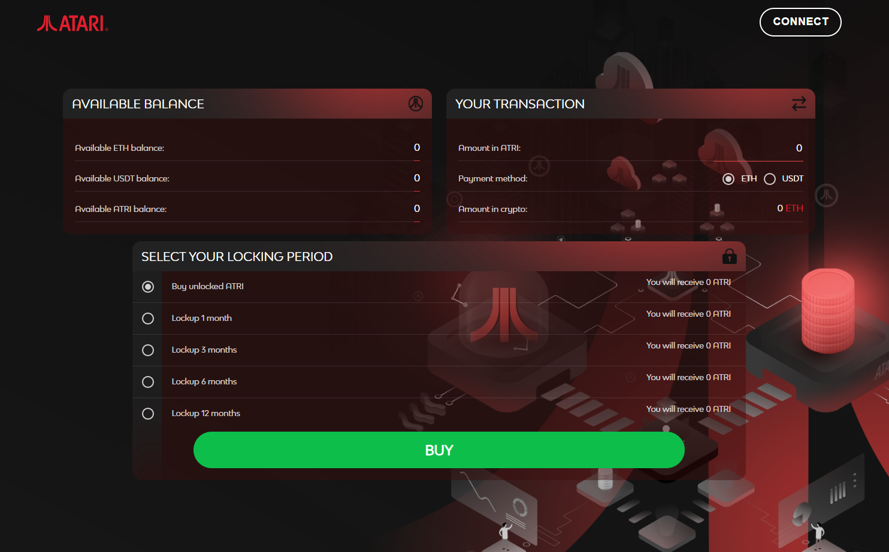</img>
</a>

- [Contract Address](https://etherscan.io/address/0x1afebf01f5ee7195c7044939e20e2fac6a60b18f#code)

#### [Benoit Token Presale](http://followupcoinpresale.com/)
---
<a href='http://followupcoinpresale.com/'>
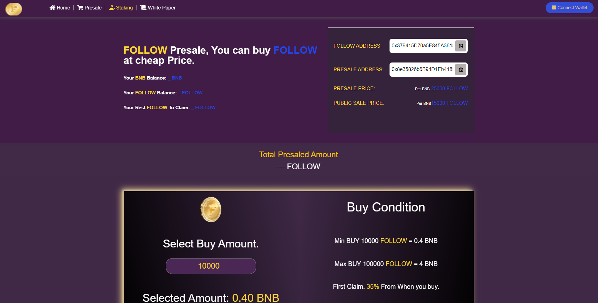</img>
</a>

- [Src](https://github.com/goldenstar111/FollowUpCoin-Presale)
- [Contract Address](https://bscscan.com/address/0x8e35826b6B94D1Eb418Ff02415Db4c2A65a0bcBE#code)

### Blockchain Bot
---
- [Flashloan Arbitrage Bot](https://github.com/goldenstar111/Arbitrage-Bot-Between-Uniswap-and-Sushiswap)
- [Coin AddLiquidity Frontrun Attack Bot](https://github.com/goldenstar111/Sandwitch-Bot-on-Eth-Python)
- [Sandwich Bot](https://github.com/goldenstar111/Sandwitch-Bot-on-Eth-Python)
- [Pancake Prediction Betting Bot](https://github.com/goldenstar111/Prediction-Betting-Bot)
- [PinkSale Trending Bot](https://github.com/goldenstar111/PinkSale-Trending-Bot)
- [Sniper Bot](https://github.com/goldenstar111/BSC-Mempool-Sniper-Bot)
- [NFT Rarity Sniper Bot on Opensea](https://github.com/goldenstar111/NFT-Sniper-bot)
- [Frontrun Attack Bot](https://github.com/goldenstar111/Pancakeswap-Frontrun-JS-Script)

### Contact Me
<!-- #### Social Link -->

<!--  -->
<!--  -->

#### Telecommunication

<!--
**goldenstar111/goldenstar111** is a ✨ _special_ ✨ repository because its `README.md` (this file) appears on your GitHub profile.

Here are some ideas to get you started:

- 🔭 I’m currently working on ...
- 🌱 I’m currently learning ...
- 👯 I’m looking to collaborate on ...
- 🤔 I’m looking for help with ...
- 💬 Ask me about ...
- 📫 How to reach me: ...
- 😄 Pronouns: ...
- ⚡ Fun fact: ...
-->
